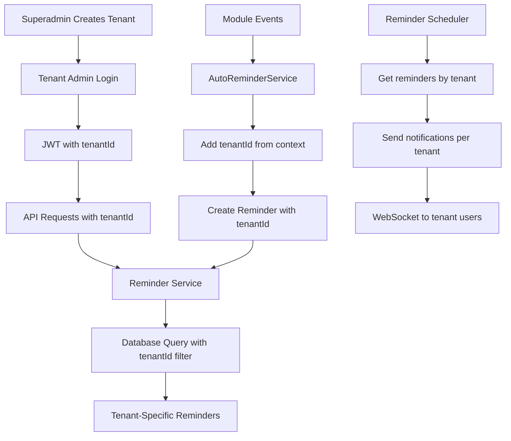

# Reminder System Implementation Plan
## Tenant-Isolated Reminder System for Solar EPC OS

### 🎯 Objective
Implement a fully tenant-isolated reminder system where:
1. **Superadmin** creates new admin users (tenants)
2. Each **admin (tenant)** sees ONLY their own reminders
3. Reminders from one tenant NEVER appear in another tenant's view
4. All modules (CRM, HRM, Finance, Inventory, etc.) generate tenant-specific reminders
5. Live notifications are properly isolated per tenant

### 📋 Current State Analysis

#### ✅ What's Already Working
1. **Database Schema**: Reminder schema already includes `tenantId` field (line 42 in `reminder.schema.ts`)
2. **Service Layer**: `ReminderService` methods accept `tenantId` parameter and filter by it
3. **Controller Layer**: `ReminderController` extracts `tenantId` from JWT/headers
4. **Security**: Uses `TenantGuard` and `JwtAuthGuard` for authentication
5. **Multi-module Support**: System can generate reminders from all business modules

#### 🔍 Areas to Verify/Improve
1. **Auto-reminder generation**: Ensure auto-reminders from modules (tasks, surveys, etc.) include correct `tenantId`
2. **Scheduler isolation**: Ensure reminder scheduler processes reminders per tenant
3. **WebSocket/Notifications**: Ensure real-time notifications are tenant-scoped
4. **Frontend filtering**: Ensure frontend only requests/display tenant-specific reminders
5. **Permission boundaries**: Ensure users can only see reminders they're assigned to within their tenant

### 🏗️ Architecture Design

#### 1. Data Flow Diagram


#### 2. Tenant Isolation Layers

| Layer | Implementation | Status |
|-------|---------------|--------|
| **Database** | `tenantId` field in all reminder documents | ✅ Implemented |
| **Service** | All queries include `{ tenantId: tenantId }` filter | ✅ Implemented |
| **API** | `TenantGuard` validates tenant access | ✅ Implemented |
| **WebSocket** | Socket rooms per tenant | 🔄 To Verify |
| **Scheduler** | Process reminders grouped by tenant | 🔄 To Verify |
| **Frontend** | API calls include `x-tenant-id` header | 🔄 To Verify |

### 🔧 Implementation Plan

#### Phase 1: Verification & Testing (Current State)
1. **Test Tenant Isolation**
   - Create two tenants (TenantA, TenantB)
   - Create reminders for TenantA
   - Login as TenantB admin
   - Verify TenantB cannot see TenantA reminders

2. **Test Auto-Reminder Generation**
   - Create a task in TenantA project
   - Verify auto-reminder includes TenantA's `tenantId`
   - Check that TenantB doesn't receive notification

3. **Test Scheduler Isolation**
   - Run reminder scheduler
   - Verify it processes reminders per tenant
   - Check notification logs for proper tenant isolation

#### Phase 2: Enhancements & Fixes
1. **WebSocket Tenant Isolation**
   ```typescript
   // Current: reminder.gateway.ts - needs verification
   // Enhancement: Ensure socket joins tenant-specific room
   socket.join(`tenant:${tenantId}`);
   ```

2. **Scheduler Tenant Grouping**
   ```typescript
   // Current: reminder-scheduler.service.ts - needs verification
   // Enhancement: Process reminders in tenant batches
   const tenants = await getActiveTenants();
   for (const tenant of tenants) {
     const reminders = await getDueReminders(tenant.id);
     // Process per tenant
   }
   ```

3. **Frontend API Integration**
   - Verify `AuthContext` extracts `tenantId` from JWT
   - Ensure all API calls include `x-tenant-id` header
   - Test reminder dashboard shows only tenant-specific data

#### Phase 3: Module Integration
1. **Ensure all module events pass tenantId**
   ```typescript
   // Example: Task completion event
   eventEmitter.emit('task.overdue', {
     taskId,
     tenantId, // MUST be included
     assignedTo,
     dueDate
   });
   ```

2. **Update auto-reminder services for all modules**
   - Tasks module
   - Surveys module  
   - Finance module (invoice due dates)
   - HRM module (leave approvals)
   - Inventory module (low stock)
   - Procurement module (PO deadlines)

#### Phase 4: Testing & Validation
1. **Create Test Scenarios**
   ```
   Scenario 1: Cross-tenant data leak test
   - Superadmin creates TenantA and TenantB
   - Create 5 reminders in TenantA
   - Login as TenantB admin
   - Expected: 0 reminders visible
   
   Scenario 2: Auto-reminder isolation
   - Create project in TenantA
   - Set task with due date
   - Expected: Reminder created with TenantA tenantId
   - Login as TenantB: No reminder visible
   
   Scenario 3: Real-time notifications
   - User in TenantA creates reminder
   - Expected: Only TenantA users receive socket notification
   - TenantB users receive no notification
   ```

### 📁 File Changes Required

#### Backend Files to Verify/Update:
1. `backend/src/modules/reminders/services/reminder-scheduler.service.ts`
   - Ensure tenant grouping in due reminder queries
   
2. `backend/src/modules/reminders/gateways/reminder.gateway.ts`
   - Implement tenant-based socket rooms
   
3. `backend/src/modules/reminders/services/auto-reminder.service.ts`
   - Verify tenantId extraction from module events
   
4. All module event emitters (tasks, surveys, finance, etc.)
   - Ensure tenantId included in event payloads

#### Frontend Files to Verify:
1. `frontend/src/context/AuthContext.js`
   - Verify tenantId extraction from JWT
   
2. `frontend/src/services/api.js`
   - Ensure `x-tenant-id` header included in all requests
   
3. `frontend/src/modules/*/components/Reminder*.js`
   - Verify reminder displays filter by tenant

### 🧪 Testing Checklist

#### Backend API Tests
- [ ] `POST /reminders` - Create reminder with tenantId
- [ ] `GET /reminders` - Returns only tenant's reminders
- [ ] `GET /reminders/:id` - Cannot access other tenant's reminder
- [ ] `PUT /reminders/:id` - Cannot update other tenant's reminder
- [ ] `DELETE /reminders/:id` - Cannot delete other tenant's reminder

#### Integration Tests
- [ ] Task overdue generates reminder with correct tenantId
- [ ] Survey deadline generates tenant-specific reminder
- [ ] Invoice due date reminder includes tenantId
- [ ] Low inventory alert scoped to tenant
- [ ] Leave approval reminder per tenant

#### Frontend Tests
- [ ] Login as TenantA shows TenantA reminders only
- [ ] Switch tenants (if multi-tenant user) shows correct reminders
- [ ] Real-time notifications only for current tenant
- [ ] Reminder counts reflect tenant-specific data

### 🔒 Security Considerations

1. **JWT Validation**: Ensure `tenantId` in JWT matches requested tenant
2. **Query Injection Prevention**: Use parameterized queries with tenantId
3. **Socket Authentication**: Validate socket connection has valid tenant access
4. **API Rate Limiting**: Per-tenant rate limiting for reminder creation
5. **Audit Logging**: Log all reminder operations with tenantId

### 📊 Monitoring & Logging

1. **Add tenant context to all logs**
   ```typescript
   this.logger.log(`Reminder created`, { 
     reminderId, 
     tenantId,
     module,
     userId 
   });
   ```

2. **Monitor cross-tenant access attempts**
   - Log when user tries to access other tenant's reminders
   - Alert on potential security breaches

3. **Performance metrics per tenant**
   - Reminder count per tenant
   - Notification delivery success rate
   - Average response time per tenant

### 🚀 Deployment Steps

1. **Backend Deployment**
   ```bash
   cd backend
   npm run build
   npm run start:prod
   ```

2. **Database Migration** (if schema changes)
   ```bash
   npx ts-node migrations/update-reminder-tenant-index.ts
   ```

3. **Frontend Deployment**
   ```bash
   cd frontend
   npm run build
   # Deploy to web server
   ```

4. **Verification**
   ```bash
   # Run test suite
   npm test -- reminder-tenant-isolation.test.ts
   
   # Manual verification
   # 1. Create two tenants
   # 2. Test reminder isolation
   # 3. Verify notifications
   ```

### 📈 Success Metrics

1. **100% Tenant Isolation**: No cross-tenant data leaks
2. **Performance**: < 100ms for reminder queries per tenant
3. **Reliability**: 99.9% successful reminder deliveries
4. **User Satisfaction**: Tenants report only seeing their own reminders

### 🆘 Troubleshooting Guide

#### Issue: Tenant seeing other tenant's reminders
**Solution**: 
1. Check JWT contains correct `tenantId`
2. Verify API request includes `x-tenant-id` header
3. Check database query includes `tenantId` filter
4. Review reminder service `findAll` method

#### Issue: Auto-reminders not tenant-scoped
**Solution**:
1. Check event payload includes `tenantId`
2. Verify `AutoReminderService` extracts tenant from context
3. Check module service passes tenantId in events

#### Issue: Real-time notifications going to wrong tenant
**Solution**:
1. Verify socket joins tenant-specific room
2. Check notification service filters by tenantId
3. Validate JWT in socket handshake

### 📚 Related Documentation

1. **Multi-tenant Architecture**: `MULTITENANT_IMPLEMENTATION_GUIDE.md`
2. **Permission System**: `PERMISSION_SYSTEM.md`
3. **Reminder Module**: `backend/src/modules/reminders/README.md`
4. **API Documentation**: `backend/src/modules/reminders/API.md`

---

## 🎯 User Scenario Implementation

### Exact User Requirement:
> "Agar super admin ne id pass create karke naya id pass banaya fir login kiya fir uske data koi or super admin ne create kiya to us email id ka data koi or email id me nhi show hona chaiye."

### Implementation Solution:
1. **User Creation Flow**:
   - Superadmin creates new tenant admin
   - Tenant admin gets unique `tenantId`
   - All data created by/for this admin includes `tenantId`

2. **Data Isolation**:
   ```javascript
   // When creating reminder
   const reminder = {
     title: "Follow up on lead",
     assignedTo: "user123",
     tenantId: "tenant_a", // ← Critical: Unique per tenant
     createdBy: "admin_tenant_a"
   };
   
   // Query always includes tenant filter
   const reminders = await Reminder.find({ 
     tenantId: currentUser.tenantId 
   });
   ```

3. **Result**: 
   - Tenant A admin sees only reminders with `tenantId: "tenant_a"`
   - Tenant B admin sees only reminders with `tenantId: "tenant_b"`
   - Zero cross-tenant data visibility

### Testing This Scenario:
```bash
# 1. Create Tenant A
curl -X POST /api/tenants -d '{"name":"SolarCompanyA"}'

# 2. Create admin for Tenant A  
curl -X POST /api/users -d '{"email":"adminA@company.com", "tenantId":"tenant_a"}'

# 3. Login as adminA, create reminder
curl -X POST /api/reminders -H "x-tenant-id: tenant_a" -d '{"title":"Test A"}'

# 4. Create Tenant B
curl -X POST /api/tenants -d '{"name":"SolarCompanyB"}'

# 5. Login as adminB, list reminders
curl -X GET /api/reminders -H "x-tenant-id: tenant_b"
# Expected: Empty array (no Tenant A reminders)
```

---

## ✅ Final Verification Checklist

- [ ] Database schema has `tenantId` in reminder collection
- [ ] All API endpoints validate tenant access
- [ ] Service layer filters all queries by `tenantId`
- [ ] Auto-reminder generation includes `tenantId`
- [ ] Scheduler processes reminders per tenant
- [ ] WebSocket notifications are tenant-scoped
- [ ] Frontend includes `x-tenant-id` in all requests
- [ ] Test suite covers cross-tenant isolation
- [ ] Audit logs track tenant context
- [ ] Documentation updated with tenant isolation details

---

*Last Updated: April 13, 2026*  
*Project: Solar EPC OS - Reminder System*  
*Status: Implementation Plan Ready*