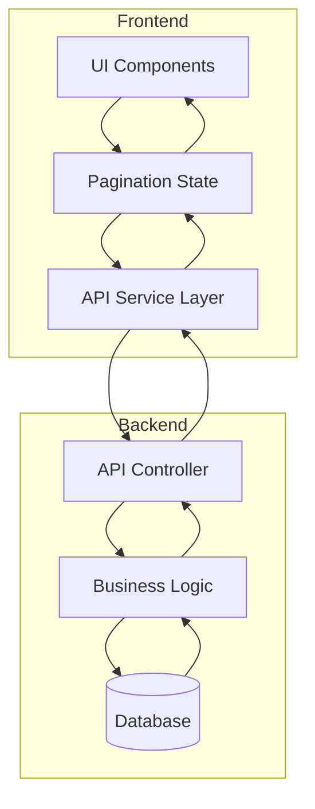
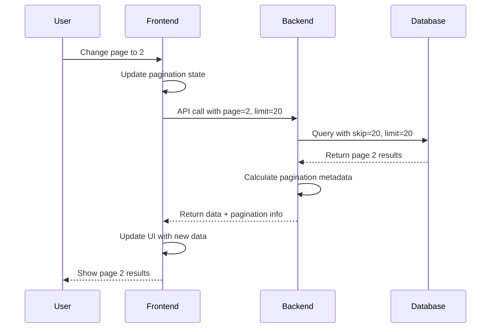
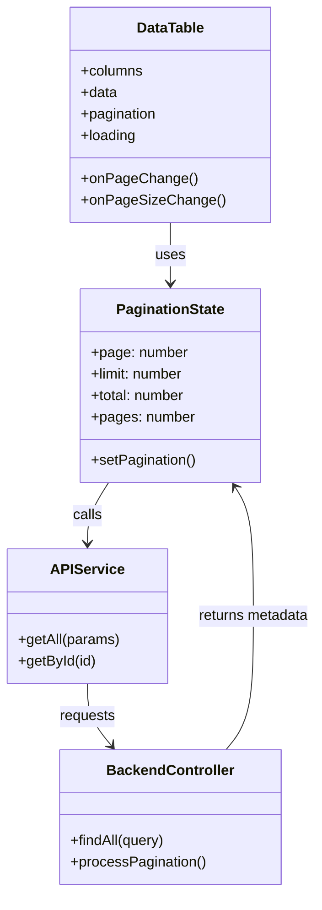

# Pagination Implementation Plan for Solar-EPC System

## Overview
This document outlines the comprehensive plan to implement and ensure pagination works properly across all modules in the Solar-EPC system. The current system has inconsistent pagination implementation, with some modules having proper pagination while others fetch all data client-side.

## Current State Analysis

### Modules with Proper Pagination
- UserManagementPage.js
- TeamManagementPage.js  
- SiteSurveyPage.js
- AttendancePage.js
- AttendancePageV3.js
- CompliancePage.js
- LogisticsPage.js
- ProcurementPage.js
- ServicePage.js

### Modules Needing Pagination Fixes
- PayrollPage.js (no pagination, fetches all records)
- HRMPage.js (likely no pagination)
- InventoryPage.js (partial implementation)
- FinancePage.js (partial implementation)
- CRMPage.js (needs verification)
- EmployeesPage.js
- ItemsPage.js
- InstallationPage.js
- CommissioningPage.js

### Backend API Audit Findings
1. **Payroll API**: `GetPayrollQueryDto` lacks pagination parameters (`page`, `limit`). Service `findAll` method returns all records.
2. **HRM APIs**: Some support params but need standardization.
3. **Pattern Inconsistency**: Different modules use different pagination patterns.

## Standardized Pagination Architecture

### Frontend Pattern

```javascript
// Standard pagination state
const [pagination, setPagination] = useState({ 
  page: 1, 
  limit: 20, 
  total: 0, 
  pages: 0 
});

// Standard API call pattern
const fetchData = useCallback(async () => {
  try {
    setLoading(true);
    const response = await Service.getAll({
      page: pagination.page,
      limit: pagination.limit,
      search: searchQuery,
      // other filters...
    });
    
    if (response.success) {
      setData(response.data);
      setPagination(response.pagination);
    }
  } catch (error) {
    console.error('Error fetching data:', error);
  } finally {
    setLoading(false);
  }
}, [pagination.page, pagination.limit, searchQuery]);

// Standard DataTable usage
<DataTable
  columns={columns}
  data={data}
  pagination={{
    page: pagination.page,
    pageSize: pagination.limit,
    total: pagination.total,
    onChange: (page) => setPagination(p => ({ ...p, page })),
    onPageSizeChange: (size) => setPagination(p => ({ ...p, limit: size, page: 1 }))
  }}
  loading={loading}
/>
```

### Backend Pattern

```typescript
// Standard DTO for paginated queries
export class PaginatedQueryDto {
  @IsNumber()
  @IsOptional()
  @Type(() => Number)
  page?: number = 1;

  @IsNumber()
  @IsOptional()
  @Type(() => Number)
  limit?: number = 20;

  @IsString()
  @IsOptional()
  search?: string;
}

// Standard service response format
interface PaginatedResponse<T> {
  success: boolean;
  data: T[];
  pagination: {
    page: number;
    limit: number;
    total: number;
    pages: number;
  };
}

// Standard service method pattern
async findAll(
  query: PaginatedQueryDto,
  tenantId?: string,
  user?: UserWithVisibility
): Promise<PaginatedResponse<Entity>> {
  const { page = 1, limit = 20, search, ...filters } = query;
  const skip = (page - 1) * limit;
  
  const queryFilter = this.buildFilter(filters, tenantId, user);
  
  if (search) {
    queryFilter.$or = [
      { name: { $regex: search, $options: 'i' } },
      // other searchable fields
    ];
  }
  
  const [data, total] = await Promise.all([
    this.model.find(queryFilter)
      .skip(skip)
      .limit(limit)
      .sort({ createdAt: -1 })
      .exec(),
    this.model.countDocuments(queryFilter)
  ]);
  
  return {
    success: true,
    data,
    pagination: {
      page,
      limit,
      total,
      pages: Math.ceil(total / limit)
    }
  };
}
```

## Implementation Roadmap

### Phase 1: Backend Foundation (Week 1)
1. **Create shared pagination DTOs and utilities**
   - `PaginatedQueryDto` base class
   - `PaginatedResponse` interface
   - Pagination utility functions

2. **Update HRM module APIs**
   - Payroll API: Add pagination to `GetPayrollQueryDto` and `findAll` method
   - Employee API: Ensure pagination support
   - Leave API: Ensure pagination support
   - Attendance API: Ensure pagination support

3. **Update other critical modules**
   - Inventory API
   - Finance API
   - CRM API

### Phase 2: Frontend Implementation (Week 2)
1. **Fix PayrollPage.js** (Priority 1)
   - Add pagination state
   - Update API calls to include pagination params
   - Add DataTable pagination props
   - Update search to work with server-side pagination

2. **Fix HRMPage.js** (Priority 2)
   - Audit all data tables
   - Implement consistent pagination pattern

3. **Fix other critical pages**
   - InventoryPage.js
   - FinancePage.js
   - EmployeesPage.js

### Phase 3: Testing and Validation (Week 3)
1. **Unit Testing**
   - Backend pagination logic
   - Frontend pagination components

2. **Integration Testing**
   - Test pagination across all fixed modules
   - Verify search + pagination combination
   - Test edge cases (empty results, single page, etc.)

3. **Performance Testing**
   - Compare load times before/after pagination
   - Test with large datasets

### Phase 4: Documentation and Standards (Week 4)
1. **Create developer documentation**
2. **Update API documentation**
3. **Create pagination guidelines for new features**

## Technical Specifications

### Backend Changes Required

#### 1. Payroll Module Updates
```typescript
// Update GetPayrollQueryDto
export class GetPayrollQueryDto extends PaginatedQueryDto {
  @IsMongoId()
  @IsOptional()
  employeeId?: string;

  @IsNumber()
  @IsOptional()
  month?: number;

  @IsNumber()
  @IsOptional()
  year?: number;
}

// Update PayrollService.findAll
async findAll(
  employeeId?: string,
  month?: number,
  year?: number,
  page: number = 1,
  limit: number = 20,
  tenantId?: string,
  user?: UserWithVisibility
): Promise<PaginatedResponse<Payroll>> {
  // Implementation with skip/limit
}
```

#### 2. Shared Pagination Utilities
Create `src/common/dto/paginated-query.dto.ts` and `src/common/interfaces/paginated-response.interface.ts`

### Frontend Changes Required

#### 1. PayrollPage.js Updates
```javascript
// Add pagination state
const [pagination, setPagination] = useState({ page: 1, limit: 20, total: 0, pages: 0 });

// Update fetchPayrolls to use pagination
const fetchPayrolls = async () => {
  try {
    setLoading(true);
    const response = await payrollApi.getAll({
      page: pagination.page,
      limit: pagination.limit,
      search: search.trim() || undefined,
    });
    
    if (response.success) {
      setPayrolls(response.data);
      setPagination(response.pagination);
    }
  } catch (error) {
    toast.error('Failed to fetch payroll records');
    setPayrolls([]);
  } finally {
    setLoading(false);
  }
};

// Update DataTable with pagination props
<DataTable
  columns={tableColumns}
  data={payrolls}
  loading={loading}
  pagination={{
    page: pagination.page,
    pageSize: pagination.limit,
    total: pagination.total,
    onChange: (page) => setPagination(p => ({ ...p, page })),
    onPageSizeChange: (size) => setPagination(p => ({ ...p, limit: size, page: 1 }))
  }}
/>
```

## Mermaid Diagrams

### System Architecture


### Pagination Flow


### Component Relationships


## Success Criteria

1. **All list views implement server-side pagination**
2. **Consistent user experience across modules**
3. **Improved performance with large datasets**
4. **Search works with pagination (server-side)**
5. **Backward compatibility maintained**
6. **Comprehensive test coverage**
7. **Clear documentation for developers**

## Risks and Mitigation

| Risk | Impact | Mitigation |
|------|--------|------------|
| Breaking existing functionality | High | Thorough testing, feature flags, gradual rollout |
| Performance regression | Medium | Benchmark before/after, optimize queries |
| Inconsistent implementation | Medium | Code reviews, shared utilities, documentation |
| Large migration effort | High | Phased approach, prioritize critical modules |

## Next Steps

1. **Immediate**: Create detailed technical specifications for PayrollPage.js fix
2. **Short-term**: Implement backend pagination utilities
3. **Medium-term**: Roll out to all identified modules
4. **Long-term**: Establish pagination as standard for all new features

## Conclusion
Implementing consistent pagination across all modules is critical for system scalability and user experience. This plan provides a structured approach to address current inconsistencies while establishing standards for future development.